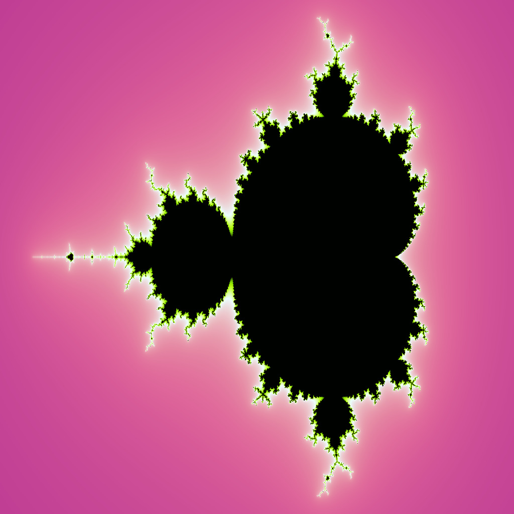

#  Fractal Processing

**Fractal Processing** is library for generating basic types of fractals with possibility to color with any linear gradient. It can also be used to monotonic color interpolation.

## Instalation
[CMake](https://cmake.org/) is required to build the library. You should also have installed Magick++ module from the [ImageMagick](https://github.com/ImageMagick/ImageMagick).

If you have already all dependencies do as follows:

```bash
git clone https://github.com/ppeczus0405/FractalProcessing
cd FractalProcessing
mkdir build && cd build
cmake .. && cmake --build .
```
Builded library is placed in lib folder.

## Documentation
Full documentation is placed inside doc folder in [html](doc/html/index.html) section.

## Examples





More in generated_images folder.

## Extras
In folder big_fractal there are fractals in high resolution ;).